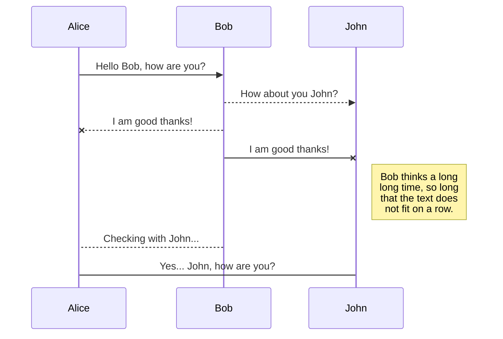
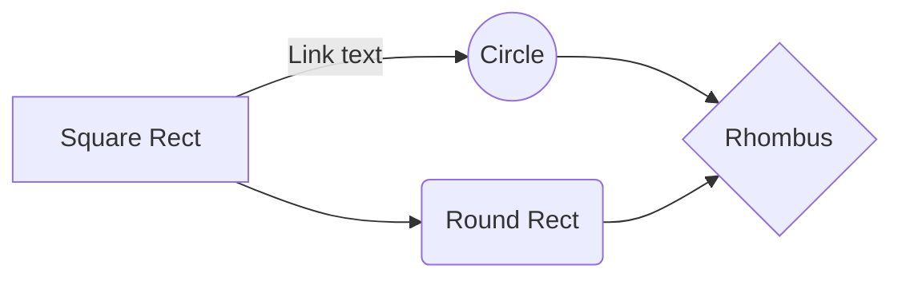

# About 
## 

 ///About 

This is a manual, how quickly and easy to run your local Corteza server without waste time. Follow exactly every step that are described bellow. This guide helps to run  local environment for development and adding any futures that are necessary in Frontend with followed explanation of deployment to Production.

# Setting up the local project

##  Copying a Docker Server locally 
Via ***WinSCP***  connect to the server where "*Corteza_app*" is located. 
Move to the ***root*** folder and then you will finally see Corteza project.
Copy and then paste anywhere on your local Laptop. Now, according to 
[official Corteza guide](https://docs.cortezaproject.org/corteza-docs/2024.9/devops-guide/#deploy-offline), File Structure should look like: 

## Configure docker-compose.yaml
Your docker-compose.yaml file supposed to be looked like: 

***Important:***
**`The version may differ from template above.`**

In docker-compose.yaml we will also have to mount more files into ***volumes*** . More about it you could see here ///[here is topic](#topic-name)

You will have to uncomment this line:

	VIRTUAL_HOST: localhost:8080

Now it looks like: 

## Configure .env

***Important:***
**`The version may differ from template above.`**

### 1. Domain
Change **DOMAIN** on the localhost, that you already set up in the ***docker-compose.yaml*** 
 *(by default is expected as 8080)* and should look like: 

### 2. Database

Copy of production Data Base should be configured locally via **pgAdmin 4**

***Important:***
**`Make sure that the PostgreSQL version on local laptop versions and PostgreSQL database version are matched.`**

After successful restoration of the database on the local laptop. 
Check, if database is ready to be connected to docker server due to this command on CMD: 

	pg_isready   

Successful output will look like that: 

We can also connect to Database via **pg_Admin 4** or **CMD** (In this example via CMD) to ensure that all data were fetched correctly.
Enter the command, that is below and connect as *"postgres"* user to database (**database name may be different, check pgAdmin 4**)

Then, enter database password (by default is: "1234" or "0000") .
And now we can receive, for example, the user "Corteza Service" or any other that exists in the DB.
If the output looks like this, the database data was retrieved successfully:

### Setting up the *DB_DSN* value in .env
Replace underlined values on your local:
 - user (username of database, by default is "postgres");
 - password (database password, by default is "1234" or "0000");
 - database (database name).
  

It might look like this: 

### 3. Authorization
As in the [Domain](#domain) settings, **AUTH_BASE_URL** should be changed on the *localhost*, that you set already up in Domain and docker-compose.yaml (VIRTUAL_HOST).

# Running docker server
Now you should install the official [Docker Desktop](https://docs.docker.com/desktop/setup/install/windows-install/) and then inside your `corteza` directory (next to your `docker-compose.yaml` and `.env` files), run the docker compose, due to command: 
	
	docker-compose up -d

Launch the *localhost:8080* on your browser, and you will see Auth. page: 

Log in **not with** Domain Credentials, but enter Email and corresponding Password users with admin permission. It might be **it-service** user.
After that you will have access to your local CRM system:

# Corteza-vue

There are two types of synchronization and they can complement each other:

- The workspace synchronization will sync all your files, folders and settings automatically. This will allow you to fetch your workspace on any other device.
	> To start syncing your workspace, just sign in with Google in the menu.

- The file synchronization will keep one file of the workspace synced with one or multiple files in **Google Drive**, **Dropbox** or **GitHub**.
	> Before starting to sync files, you must link an account in the **Synchronize** sub-menu.

## Open a file

You can open a file from **Google Drive**, **Dropbox** or **GitHub** by opening the **Synchronize** sub-menu and clicking **Open from**. Once opened in the workspace, any modification in the file will be automatically synced.

## Save a file

You can save any file of the workspace to **Google Drive**, **Dropbox** or **GitHub** by opening the **Synchronize** sub-menu and clicking **Save on**. Even if a file in the workspace is already synced, you can save it to another location. StackEdit can sync one file with multiple locations and accounts.

## Synchronize a file

Once your file is linked to a synchronized location, StackEdit will periodically synchronize it by downloading/uploading any modification. A merge will be performed if necessary and conflicts will be resolved.

If you just have modified your file and you want to force syncing, click the **Synchronize now** button in the navigation bar.

> **Note:** The **Synchronize now** button is disabled if you have no file to synchronize.

## Manage file synchronization

Since one file can be synced with multiple locations, you can list and manage synchronized locations by clicking **File synchronization** in the **Synchronize** sub-menu. This allows you to list and remove synchronized locations that are linked to your file.

# Publication

Publishing in StackEdit makes it simple for you to publish online your files. Once you're happy with a file, you can publish it to different hosting platforms like **Blogger**, **Dropbox**, **Gist**, **GitHub**, **Google Drive**, **WordPress** and **Zendesk**. With [Handlebars templates](http://handlebarsjs.com/), you have full control over what you export.

> Before starting to publish, you must link an account in the **Publish** sub-menu.

## Publish a File

You can publish your file by opening the **Publish** sub-menu and by clicking **Publish to**. For some locations, you can choose between the following formats:

- Markdown: publish the Markdown text on a website that can interpret it (**GitHub** for instance),
- HTML: publish the file converted to HTML via a Handlebars template (on a blog for example).

## Update a publication

After publishing, StackEdit keeps your file linked to that publication which makes it easy for you to re-publish it. Once you have modified your file and you want to update your publication, click on the **Publish now** button in the navigation bar.

> **Note:** The **Publish now** button is disabled if your file has not been published yet.

## Manage file publication

Since one file can be published to multiple locations, you can list and manage publish locations by clicking **File publication** in the **Publish** sub-menu. This allows you to list and remove publication locations that are linked to your file.

# Markdown extensions

StackEdit extends the standard Markdown syntax by adding extra **Markdown extensions**, providing you with some nice features.

> **ProTip:** You can disable any **Markdown extension** in the **File properties** dialog.

## SmartyPants

SmartyPants converts ASCII punctuation characters into "smart" typographic punctuation HTML entities. For example:

|                |ASCII                          |HTML                         |
|----------------|-------------------------------|-----------------------------|
|Single backticks|`'Isn't this fun?'`            |'Isn't this fun?'            |
|Quotes          |`"Isn't this fun?"`            |"Isn't this fun?"            |
|Dashes          |`-- is en-dash, --- is em-dash`|-- is en-dash, --- is em-dash|

## KaTeX

You can render LaTeX mathematical expressions using [KaTeX](https://khan.github.io/KaTeX/):

The *Gamma function* satisfying $\Gamma(n) = (n-1)!\quad\forall n\in\mathbb N$ is via the Euler integral

$$
\Gamma(z) = \int_0^\infty t^{z-1}e^{-t}dt\,.
$$

> You can find more information about **LaTeX** mathematical expressions [here](http://meta.math.stackexchange.com/questions/5020/mathjax-basic-tutorial-and-quick-reference).

## UML diagrams

You can render UML diagrams using [Mermaid](https://mermaidjs.github.io/). For example, this will produce a sequence diagram:

And this will produce a flow chart:

> Written with [StackEdit](https://stackedit.io/).
